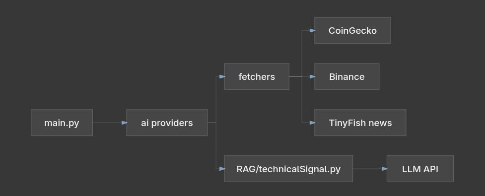

# AI-Crypto-Analize




# BETA 2.0 VERSION  

## Alert

This project is run on the latest python version above 3.14 so make sure you update your python first

## instalation

Clone the repository into your local project

```bash
git clone https://github.com/019-Mahansa/AI-Crypto-Analize

cd AI-Crypto-Analize
```

Install all depedency by creating environment variable first

```bash
pip install -m venv .venv
source ./.venv/bin/activate

#install the depedency
pip install -r requirements.txt
```

Setup your API key

```bash
#Chart action
COIN_GEKO_API="Your_api_key"

#LLM
OPENROUTER_API="Your_api_key"
DEEPSEEK_API="Your_api_key"
GEMINI_API_KEY="Your_api_key"

#Web search
TINYFISH_API_KEY="Your_api_key"

#Testing
NVIDIA_API_KEY="Your_api_key"
```

Get your API key from these URL:

Coin_geko = https://www.coingecko.com/en/api

Openrouter = https://openrouter.ai/

Deepseek = https://platform.deepseek.com/api_keys

Gemini = https://aistudio.google.com/api-keys

TinyFish = https://agent.tinyfish.ai/api-keys

Run the code

```bash
python main.py
```

# Contribute

If you want to collaborate togather you can DM my linkedIn

My linkedIn username: mahansa putra wibisono
